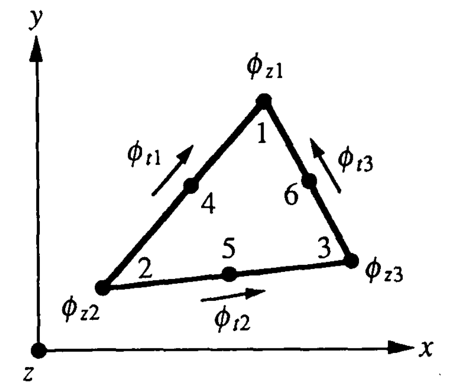

# 3. Formulação por elementos finitos

Os campos eletromagnéticos devem ser tangencialmente contínuos através das interfaces entre materiais. Nos elementos de aresta [5], [8]–[10], [16]–[20], essa continuidade tangencial pode ser imposta de maneira direta.

Hano [5] desenvolveu o método dos elementos finitos com elementos de aresta retangulares para resolver problemas de guiamento de ondas não homogêneos. Kikuchi [16], por outro lado, utilizou elementos de aresta triangulares para tratar guias de onda com geometrias arbitrárias. Entretanto, em [16], apenas guias de onda ocos homogêneos foram analisados.

Nesta seção, aplica-se o elemento de aresta triangular [16], que é diferente daquele utilizado por Hano [8], a problemas de guiamento de ondas não homogêneos.

## 3.1 Elemento de aresta triangular

Os seis nós descritos no elemento de aresta triangular consistem nos três pontos de vértice e nos três pontos laterais, conforme mostrado na Figura 1.

**Figura 1 — Elemento de aresta triangular.**

Os pontos de vértice 1 a 3 são usados para a componente axial $\phi_z$, isto é, $E_z$ ou $H_z$, enquanto os pontos laterais 4 a 6 são usados para a componente tangencial $\phi_t$, isto é, $E_t$ ou $H_t$.

A componente axial $\phi_z$ é aproximada por um polinômio completo de primeira ordem:

$$
\phi_z = j\{N(x,y)\}^T\{\phi_z\}_e = j\{N\}^T\{\phi_z\}_e
$$

**Equação (7)**

com:

$$
\{N\} = \begin{bmatrix}
L_1 \\
L_2 \\
L_3
\end{bmatrix} = \frac{1}{2A_e} \begin{bmatrix}
a_1 & b_1 & c_1 \\
a_2 & b_2 & c_2 \\
a_3 & b_3 & c_3
\end{bmatrix}
\begin{bmatrix}
1 \\
x \\
y
\end{bmatrix}
$$

**Equação (8)**

em que $\{\phi_z\}_e$ é o vetor nodal do campo axial para cada elemento, $\{N\}$ é o vetor usual de funções de forma do elemento triangular linear, $L_k$, com $k = 1, 2, 3$, são as coordenadas de área, e a área do elemento, $A_e$, bem como os coeficientes $a_k$, $b_k$ e $c_k$, são dados por:

$$
2A_e =
\begin{vmatrix}
1 & 1 & 1 \\
x_1 & x_2 & x_3 \\
y_1 & y_2 & y_3
\end{vmatrix}
$$

**Equação (9)**

$$
a_k = x_l y_m - x_m y_l
$$

**Equação (10)**

$$
b_k = y_l - y_m
$$

**Equação (11)**

$$
c_k = x_m - x_l
$$

**Equação (12)**

Aqui, $x_k$ e $y_k$, com $k = 1, 2, 3$, são as coordenadas cartesianas dos pontos de vértice 1 a 3 do triângulo. Os subscritos $k$, $l$ e $m$ sempre avançam módulo 3, isto é, ciclicamente ao redor dos três vértices do triângulo.

As componentes transversais $\phi_x$, isto é, $E_x$ ou $H_x$, e $\phi_y$, isto é, $E_y$ ou $H_y$, são aproximadas por uma função linear de $y$ e de $x$, respectivamente:

$$
\phi_x = \{U(y)\}^T\{\phi_t\}_e = \{U\}^T\{\phi_t\}_e
$$

**Equação (13)**

$$
\phi_y = \{V(x)\}^T\{\phi_t\}_e = \{V\}^T\{\phi_t\}_e
$$

**Equação (14)**

com:

$$
\{U\} = \begin{bmatrix}
\bar{a}_1 + \bar{c}_1 y \\
\bar{a}_2 + \bar{c}_2 y \\
\bar{a}_3 + \bar{c}_3 y
\end{bmatrix}
$$

**Equação (15)**

e:

$$
\{V\} = \begin{bmatrix}
\bar{b}_1 - \bar{c}_1 x \\
\bar{b}_2 - \bar{c}_2 x \\
\bar{b}_3 - \bar{c}_3 x
\end{bmatrix}
$$

**Equação (16)**

em que $\{\phi_t\}_e$ representa as variáveis de aresta no plano transversal para cada elemento. Os vetores $\{U\}$ e $\{V\}$ são os vetores de funções de forma do elemento de aresta triangular, e os coeficientes $\bar{a}_k$, $\bar{b}_k$ e $\bar{c}_k$ são dados por:

$$
\bar{a}_k = \frac{
\left[
\left(
y_{m+3}\cos\theta_{m+3} -
x_{m+3}\sin\theta_{m+3}
\right)
\sin\theta_{l+3} -
\left(
y_{l+3}\cos\theta_{l+3} -
x_{l+3}\sin\theta_{l+3}
\right)
\sin\theta_{m+3}
\right]
}{\Delta}
$$

**Equação (17)**

$$
\bar{b}_k =
\frac{
\left[
\left(
y_{l+3}\cos\theta_{l+3} -
x_{l+3}\sin\theta_{l+3}
\right)
\cos\theta_{m+3} -
\left(
y_{m+3}\cos\theta_{m+3} -
x_{m+3}\sin\theta_{m+3}
\right)
\cos\theta_{l+3}
\right]
}{\Delta}
$$

**Equação (18)**

$$
\bar{c}_k = \frac{
\cos\theta_{l+3}\sin\theta_{m+3} -
\cos\theta_{m+3}\sin\theta_{l+3}
}{\Delta}
$$

**Equação (19)**

com:

$$
0 \leq \theta_{k+3} =
\tan^{-1}
\left\{
\frac{y_k - y_l}{x_k - x_l}
\right\} < \pi
$$

**Equação (20)**

e:

$$
\Delta = \sum_{k=1}^{3} \left(y_{k+3}\cos\theta_{k+3} - x_{k+3}\sin\theta_{k+3} \right) \left(\cos\theta_{l+3}\sin\theta_{m+3} - \cos\theta_{m+3}\sin\theta_{l+3} \right)
$$

**Equação (21)**

Aqui, $x_{k+3}$ e $y_{k+3}$, com $k = 1, 2, 3$, são as coordenadas cartesianas dos pontos laterais 4 a 6 do triângulo.

Observe que a componente tangencial,

$$
\phi_t = 
\phi_x \cos\theta +
\phi_y \sin\theta
$$

é contínua ao longo das fronteiras entre elementos e é constante em cada lado dos triângulos.

## 3.2 Discretização por elementos finitos

Dividindo-se a seção transversal do guia de onda em um número de elementos de aresta, expandem-se as componentes transversais $\phi_x$, $\phi_y$ e a componente axial $\phi_z$ em cada elemento como:

$$
\phi = [N]^T\{\phi\}_e
$$

**Equação (22)**

com:

$$
\{\phi\}_e = \begin{bmatrix}
\{\phi_t\}_e \\
\{\phi_z\}_e
\end{bmatrix}
$$

**Equação (23)**

e:

$$
[N] = \begin{bmatrix}
\{U\} & \{V\} & \{0\} \\
\{0\} & \{0\} & j\{N\}
\end{bmatrix}
$$

**Equação (24)**

em que $\{0\}$ é um vetor nulo.

Substituindo a Equação (22) na Equação (6), a partir do princípio variacional obtém-se o seguinte problema de autovalores:

$$
[K]\{\phi\} - k_0^2[M]\{\phi\} = \{0\}
$$

**Equação (25)**

com:

$$
[K] = \begin{bmatrix}
[K_{tt}] & [K_{tz}] \\
[K_{zt}] & [K_{zz}]
\end{bmatrix}
\sum_e
\iint_e
[B]^*[p][B]^T
dxdy
$$

**Equação (26)**

e:

$$
[M] =
\begin{bmatrix}
[M_{tt}] & [0] \\
[0] & [M_{zz}]
\end{bmatrix} =
\sum_e
\iint_e
[N]^*[q][N]^T dxdy
$$

**Equação (27)**

A matriz $[B]$ é dada por:

$$
[B] =
\begin{bmatrix}
j\beta\{V\} & -j\beta\{U\} & -\{U_y\}+\{V_x\} \\
j\{N_y\} & j\{N_x\} & \{0\}
\end{bmatrix}
$$

**Equação (28)**

em que $\{\phi\}$ é o vetor global de campo e as submatrizes de $[K]$ e $[M]$ são dadas por:

$$
[K_{tt}] =
\sum_e
\iint_e
\left[
p_x\beta^2\{V\}\{V\}^T + p_y\beta^2\{U\}\{U\}^T +
4p_z\{U_y\}\{U_y\}^T
\right]
dxdy
$$

**Equação (29a)**

$$
[K_{tz}]
= [K_{zt}]^T =
\sum_e
\iint_e
\left[
p_x\beta\{V\}\{N_y\}^T +
p_y\beta\{U\}\{N_x\}^T \right]
dxdy
$$

**Equação (29b)**

$$
[K_{zz}] =
\sum_e
\iint_e
\left[
p_x\{N_y\}\{N_y\}^T +
p_y\{N_x\}\{N_x\}^T
\right]
dxdy
$$

**Equação (29c)**

$$
[M_{tt}] =
\sum_e
\iint_e
\left[
q_x\{U\}\{U\}^T +
q_y\{V\}\{V\}^T
\right]
dx\,dy
$$

**Equação (30a)**

$$
[M_{zz}] =
\sum_e
\iint_e
q_z\{N\}\{N\}^T
\,dx\,dy
$$

**Equação (30b)**

Aqui,

$$
\{N_x\}=\frac{\partial\{N\}}{\partial x},
\qquad
\{N_y\}=\frac{\partial\{N\}}{\partial y},
\qquad
\{U_y\}=\frac{\partial\{U\}}{\partial y},
\qquad
\{V_x\}=\frac{\partial\{V\}}{\partial x}
$$

A Equação (25) pode ser reescrita como:

$$
[K_{tt}]\{\phi_t\} -
\beta[K_{tz}]\{\phi_z\} -
\beta^2[M_{tt}]\{\phi_t\} =
\{0\}
$$

**Equação (31a)**

$$
-\beta[K_{zt}]\{\phi_t\} +
[K_{zz}]\{\phi_z\} = \{0\}
$$

**Equação (31b)**

com:

$$
[K_{tt}] =
\sum_e
\iint_e
\left[
q_xk_0^2\{U\}\{U\}^T +
q_yk_0^2\{V\}\{V\}^T -
4p_z\{U_y\}\{U_y\}^T
\right]
dxdy
$$

**Equação (32a)**

$$
[K_{tz}] =
[K_{zt}]^T =
\sum_e
\iint_e
\left[
p_x\{V\}\{N_y\}^T +
p_y\{U\}\{N_x\}^T
\right]
dxdy
$$

**Equação (32b)**

$$
[K_{zz}] = \sum_e
\iint_e
\left[
q_zk_0^2\{N\}\{N\}^T -
p_x\{N_y\}\{N_y\}^T -
p_y\{N_x\}\{N_x\}^T
\right]
dxdy
$$

**Equação (32c)**

$$
[M_{tt}] =
\sum_e
\iint_e
\left[
p_x\{V\}\{V\}^T +
p_y\{U\}\{U\}^T
\right]
dxdy
$$

**Equação (33)**

Observe que as submatrizes nas Equações (32) e (33) são diferentes daquelas nas Equações (29) e (30).

Substituindo a Equação (31b) na Equação (31a), obtém-se o seguinte problema final de autovalores:

$$
[K_{tt}]\{\phi_t\} -
\beta^2[\hat{M}_{tt}]\{\phi_t\} =
\{0\}
$$

**Equação (34)**

com:

$$
[\hat{M}_{tt}] = [M_{tt}] +
[K_{tz}][K_{zz}]^{-1}[K_{zt}]
$$

**Equação (35)**

Observe que a Equação (34) fornece uma solução direta para a constante de propagação e para a correspondente distribuição de campo, envolvendo apenas as variáveis de aresta no plano transversal, $\{\phi_t\}$.

Entretanto, é importante destacar o preço pago por essa simplificação: uma inversão de matriz precisa ser realizada e a esparsidade das matrizes é destruída.

As integrais necessárias para construir as matrizes elementares são resumidas no Apêndice.
