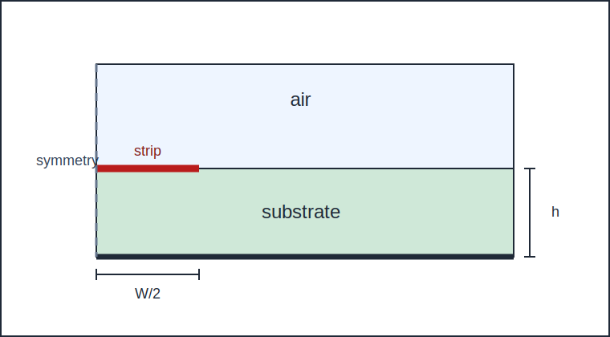
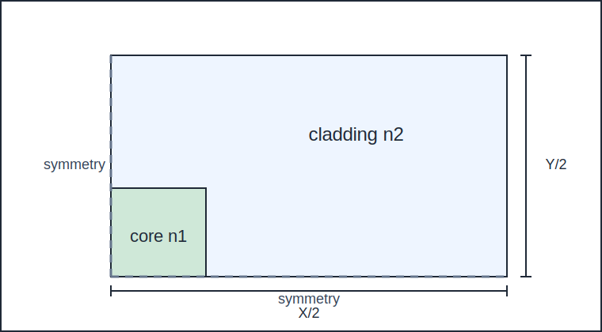
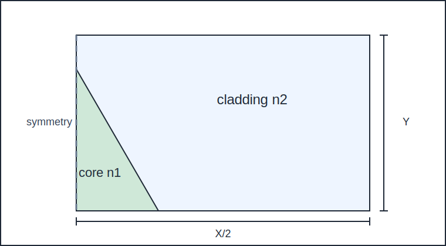

# 4. Exemplos numéricos

> **Navegação dos docs:** [Índice](README.md) | [00](00_resumo.md) | [01](01_introducao.md) | [02](02_equacoes_basicas.md) | [03](03_formulacao_elementos_finitos.md) | [04](04_exemplos_numericos.md) | [05](05_conclusao.md) | [06](06_apendice.md) | [07](07_referencias.md) | [08](08_notas_editoriais_e_cientificas.md) | [09](09_maxwell_para_equacao_01.md) | [10](10_equacao_01_para_funcional_06.md) | [11](11_origem_do_fator_j_equacao_07.md) | [12](12_funcoes_de_forma_nodais_e_de_aresta.md) | [13](13_revisao_das_integrais_do_apendice.md) | [14](14_integrais_cruzadas_e_termos_ausentes.md) | [15](15_testes_matematicos_minimos.md) | [16](16_contrato_para_implementacao_cpp.md) | [17](17_implementacao_fase7_solver_beta.md) | [18](18_politica_pec_pmc.md) | [19](19_auditoria_sinais_acoplamentos.md) | [20](20_dossie_casos_validacao_figuras.md)

Primeiramente, considera-se uma linha de transmissão microstrip, mostrada na Figura 2, e subdivide-se metade da seção transversal do guia de onda em elementos de aresta. Foram usados os seguintes parâmetros:

$$
W = 1{,}27 \ \text{mm}
$$

$$
t = 0
$$

$$
h = 1{,}27 \ \text{mm}
$$

$$
X = 12{,}7 \ \text{mm}
$$

$$
Y = 12{,}7 \ \text{mm}
$$

**Figura 2 — Linha de transmissão microstrip blindada.**

As Figuras 3(a) e 3(b) mostram as características de propagação dos dois primeiros modos de uma microstrip sobre um substrato isotrópico com:

$$
\varepsilon_r = 8{,}875
$$

e de uma microstrip sobre um substrato anisotrópico com:

$$
\varepsilon_{rx} = \varepsilon_{rz} = 9{,}4
$$

$$
\varepsilon_{ry} = 11{,}6
$$

respectivamente.

**Figura 3(a)** — Características de propagação de uma linha de transmissão microstrip em substrato isotrópico.

**Figura 3(b)** — Características de propagação de uma linha de transmissão microstrip em substrato anisotrópico.

> **Nota editorial:** as imagens originais das curvas não são versionadas neste repositório por política de direitos autorais. As reproduções próprias devem ser geradas por `scripts/run/run_all_validation.sh` e `scripts/plot/plot_validation.py`, com comparação quantitativa registrada por `scripts/plot/compare_validation.py`.

Nesses cálculos, o número de elementos, o número de pontos de vértice e o número de pontos laterais foram:

$$
N_E = 364
$$

$$
N_C = 210
$$

$$
N_S = 573
$$

Os resultados obtidos concordam bem com aqueles previamente relatados tanto para o caso isotrópico [21]–[23] quanto para o caso anisotrópico [23], [24].

Em seguida, considera-se um guia de onda retangular dielétrico, mostrado na Figura 4, em que $n_1$ e $n_2$ são os índices de refração das regiões do núcleo e do revestimento, respectivamente.

**Figura 4 — Guia de onda retangular dielétrico.**

Devido à simetria dupla do sistema, subdivide-se apenas um quarto da seção transversal do guia de onda em elementos de aresta.

Para simplificar, assumindo que as fronteiras artificiais $x = \pm X/2$ e $y = \pm Y/2$ estão suficientemente afastadas da região do núcleo, a estrutura original não limitada é substituída por uma estrutura limitada correspondente.

Nessas fronteiras artificiais, as condições de condutor elétrico perfeito ou condutor magnético perfeito são impostas de forma adequada, de modo a não restringir a componente eletromagnética dominante do campo nessas regiões.

A Figura 5 mostra as características de propagação desse guia de onda. Foram utilizados os seguintes parâmetros:

$$
W = 2t
$$

$$
X = 10t
$$

$$
Y = 5t
$$

$$
N_E = 320
$$

$$
N_C = 187
$$

$$
N_S = 506
$$

**Figura 5(a)** — Características de propagação de um guia de onda retangular dielétrico. Modos $E^x_{11}$ e $E^x_{21}$, com $n_1 = 1{,}05$ e $n_2 = 1{,}0$.

**Figura 5(b)** — Características de propagação de um guia de onda retangular dielétrico. Modos $E^y_{11}$ e $E^y_{21}$, com $n_1 = 1{,}05$ e $n_2 = 1{,}0$.

**Figura 5(c)** — Características de propagação de um guia de onda retangular dielétrico. Modos $E^x_{11}$ e $E^y_{11}$, com $n_1 = 1{,}5$ e $n_2 = 1{,}0$.

> **Nota editorial:** as curvas próprias da Figura 5 são artefatos gerados em `out/validation/`. A reprodução científica só deve ser declarada quando houver CSV de referência e erro quantitativo dentro das tolerâncias registradas no dossiê.

A frequência normalizada $v$ e a constante de propagação normalizada $b$ são definidas como:

$$
v =
\frac{
k_0 t \sqrt{n_1^2 - n_2^2}
}{\pi}
$$

**Equação (36)**

$$
b =
\frac{
\left(\frac{\beta}{k_0}\right)^2 - n_2^2
}{
n_1^2 - n_2^2
}
$$

**Equação (37)**

Os resultados obtidos concordam bem com os resultados do método de casamento de pontos [25].

Os resultados obtidos pelo método de Marcatili [26] desviam-se daqueles do método de casamento de pontos em frequências mais baixas.

Por fim, considera-se um guia de onda com núcleo triangular equilátero, mostrado na Figura 6, e subdivide-se metade da seção transversal do guia de onda em elementos de aresta.

**Figura 6 — Guia de onda com núcleo triangular equilátero.**

A Figura 7 mostra as características de propagação para o modo $E^y_{11}$ desse guia de onda, com:

$$
X = 6t
$$

$$
Y = 5t
$$

$$
N_E = 360
$$

$$
N_C = 208
$$

$$
N_S = 567
$$

**Figura 7(a)** — Características de propagação do modo $E^y_{11}$ em um guia de onda com núcleo triangular equilátero, com $n_1 = 1{,}5085$ e $n_2 = 1{,}50$.

**Figura 7(b)** — Características de propagação do modo $E^y_{11}$ em um guia de onda com núcleo triangular equilátero, com $n_1 = 1{,}5$ e $n_2 = 1{,}0$.

> **Nota editorial:** as curvas originais da Figura 7 não são versionadas. Os gráficos próprios gerados pelo projeto devem ser comparados numericamente antes de qualquer afirmação de reprodução.

As soluções pelo método dos elementos finitos com formulação por elementos de aresta concordam bem com aquelas da formulação por campo axial, isto é, usando $E_z$ e $H_z$ [27], e também com aquelas da formulação vetorial completa em termos do campo $\mathbf{H}$, usando coeficiente de penalidade $s = 1$ [28].

Observe que soluções espúrias estão incluídas nas soluções por elementos finitos da formulação baseada em campo axial. Para evitar confusão, tais soluções espúrias não são mostradas na Figura 7(a).

No método de elementos de aresta, soluções espúrias não aparecem. Além disso, o problema de autovalores recém-derivado, apresentado na Equação (34), não produz os autovalores nulos [5], [8]–[10] que estão presentes na Equação (25).

A convergência das soluções foi verificada aumentando-se o número de elementos e os valores de $X$ e $Y$, de modo que a influência das fronteiras artificiais fosse desprezível.
